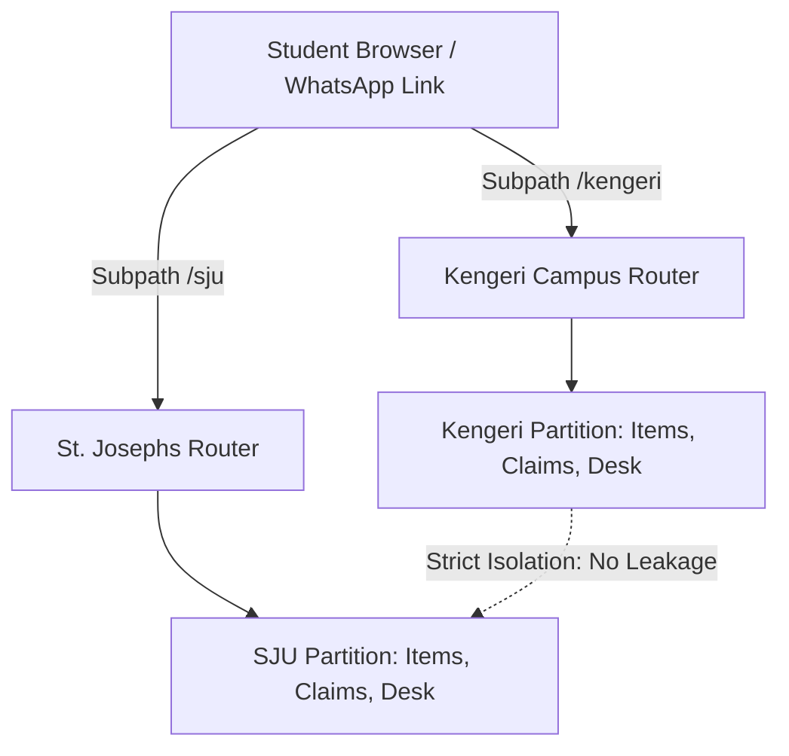

# CampusFind System Architecture

This document outlines the architectural principles, data flow, multi-tenant isolation, spatial resolution algorithms, and security boundaries implemented in CampusFind.

---

## High-Level System Architecture

CampusFind is built as a mobile-first Progressive Web Application (PWA) with strict Separation of Concerns (SoC) across four distinct tiers:

```
+-------------------------------------------------------------------------+
|                         TIER 1: PRESENTATION                            |
|  Next.js 16 App Router (React 19, Tailwind CSS, MapLibre GL vector maps) |
|  - Map view (/[campus])           - Single-surface capture (/report)    |
|  - Search feed (/[campus]/list)   - Share permalink (/[campus]/item/:id)|
|  - Activity hub (/[campus]/me)    - Staff desk portal (/[campus]/desk)  |
+------------------------------------+------------------------------------+
                                     | HTTP / JSON Envelopes
+------------------------------------v------------------------------------+
|                      TIER 2: API & CONTROLLER                           |
|  Next.js Route Handlers (app/api/*)                                     |
|  - Zod request body validation     - HTTP session cookie issuance       |
|  - Endpoint security checks        - Uniform JSON error responses       |
+------------------------------------+------------------------------------+
                                     | Typed Async Method Calls
+------------------------------------v------------------------------------+
|                    TIER 3: DOMAIN BUSINESS LOGIC                        |
|  Stateless Domain Modules (lib/*)                                       |
|  - Campus resolver (lib/campus)    - Spatial Haversine (lib/location)   |
|  - Secret hashing (lib/security)   - Zod validation (lib/schemas)       |
|  - Jaccard ranking (lib/store)     - ISO Time formatting (lib/time)     |
+------------------------------------+------------------------------------+
                                     | Persistence Abstraction
+------------------------------------v------------------------------------+
|                     TIER 4: STORAGE & PERSISTENCE                       |
|  Data Access Layer (lib/store.ts)                                       |
|  - Campus workspaces               - Device sessions                    |
|  - Items & match indices           - Claims & OTP challenges            |
|  - Abuse audit records             - Desk inventory state machine       |
+-------------------------------------------------------------------------+
```

---

## Multi-Tenant Isolation: Campus as Tenant

CampusFind treats the **Campus**, not the individual user or university umbrella, as the atomic tenant boundary.

### Isolation Rules

1. **Subpath URL Routing:** Every campus-scoped page and API endpoint is anchored by the URL slug:
   - Client routes: `/[campus]`, `/[campus]/report`, `/[campus]/list`, `/[campus]/item/[id]`, `/[campus]/desk`
   - API endpoints: `/api/[campus]/items`, `/api/[campus]/claims`, `/api/[campus]/desk/...`
2. **Strict Query Partitioning:** Every read and write operation in the data store enforces `item.campusSlug === campusSlug`.
   - Items from one campus are physically filtered out from other campuses.
   - Cross-campus search queries are prevented.
3. **Dedicated Gazetteers:** Each campus maintains its own centroid, perimeter fence radius, and building landmark dataset.
4. **File Storage Isolation:** Photos are partitioned into campus-specific directories: `public/campuses/{slug}/items/{id}.jpg`.



---

## Spatial Indexing & Location Resolution

Rather than relying on inaccurate indoor GPS or requiring expensive beacons, CampusFind uses an intelligent door-approximate snap algorithm based on the Haversine formula:

$$\Delta\sigma = 2 \arcsin \sqrt{\sin^2\left(\frac{\Delta\phi}{2}\right) + \cos\phi_1 \cos\phi_2 \sin^2\left(\frac{\Delta\lambda}{2}\right)}$$

$$d = R \cdot \Delta\sigma$$

Where $R = 6,371,000\text{ m}$.

### Resolution Hierarchy

```
Device GPS Received (lat, lng, accuracy)
  │
  ├─► Distance from Campus Centroid > fence_m?
  │     └─► YES: Mark offCampus = true, alert student to pick campus building
  │
  ├─► Nearest landmark distance < 40 meters?
  │     └─► YES: Auto-snap location to landmark (source = "gps_snap")
  │
  ├─► Nearest landmark distance between 40m and 120m?
  │     └─► YES: Suggest nearest building chip, preserve raw coordinates (source = "gps_raw")
  │
  └─► Nearest landmark distance > 120 meters?
        └─► YES: Retain raw GPS coordinates, require manual building selection
```

---

## Cryptographic Privacy & Security Model

CampusFind guarantees that private identifying marks on lost belongings are never exposed or readable by third parties.

### 1. SHA-256 Secret Proof Hashing

When a finder logs a distinctive detail (e.g. "Cat sticker on the back cover"):
1. The server normalizes the string:
   $$\text{normalized} = \text{input}.\text{trim}().\text{toLowerCase}().\text{replace}(/\backslash\text{s}+/g, \text{ ' '})$$
2. The server hashes the normalized string using SHA-256:
   $$\text{hash} = \text{SHA256}(\text{normalized})$$
3. Only the 64-character hexadecimal digest is stored in the database.
4. When a student files a claim with their guess, the server hashes the claimant's input and checks for a constant-time cryptographic match. Plaintext secrets are never stored, logged, or embedded in vector models.

### 2. Sanitized Data Envelopes

API endpoints strip internal session tokens, user IDs, and secret hashes before returning item payloads to the client:

```typescript
function sanitizeItem(item: ItemRecord): PublicItem {
  const { secretHash, posterSessionId, posterUserId, ...publicFields } = item;
  return publicFields;
}
```

### 3. Fail-Closed Abuse Mitigation

To protect students from malicious posts:
- Any authenticated or anonymous device session can file a report (`spam`, `inappropriate`, `wrong`, `other`).
- Duplicate reports from the same device session are de-duplicated.
- When **3 distinct device sessions** report an item, the item's status automatically transitions to `hidden`.
- Queries via `getItem` return HTTP 404 for any item with `status === "hidden"`.

---

## Candidate Matching Engine

When a new lost or found item is pinned, CampusFind computes real-time similarity scores against opposite-type items within the same campus over the preceding 14 days:

$$\text{Score} = S_{\text{place}} + S_{\text{distance}} + S_{\text{tags}} + S_{\text{time}}$$

Where:
- $S_{\text{place}} = 3$ if `itemA.placeId === itemB.placeId`, else $0$.
- $S_{\text{distance}} = 2$ if $\text{Haversine}(A, B) < 150\text{ m}$, else $0$.
- $S_{\text{tags}} = 1.5 \times \frac{|A_{\text{tags}} \cap B_{\text{tags}}|}{|A_{\text{tags}} \cup B_{\text{tags}}|}$ (Jaccard token similarity across categories and titles).
- $S_{\text{time}} = 0.5 \times \max\left(0, 1 - \frac{\text{hoursBetween}(A, B)}{336}\right)$ (linear 14-day temporal decay).

Top 3 scoring candidates are linked in `item.matchIds`. Matching items are proposed to human users for confirmation and are never automatically closed.
